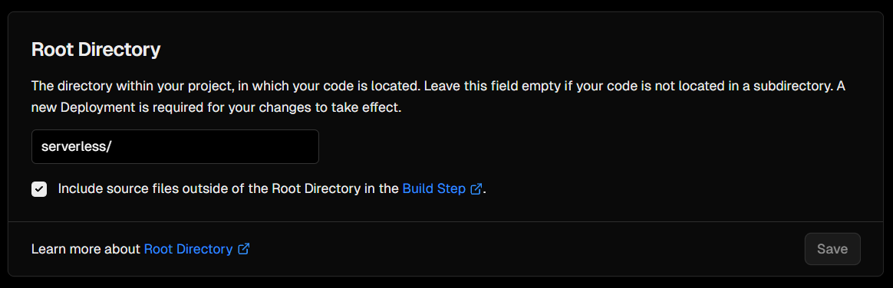

# Serve BE on serverless platform

## Here we use [vercel](https://vercel.com/) to deploy BE on serverless platform.

### Notes: When deploying BE on serverless platform, some functions and features may not work as expected.

### Required: 
- Set `DEPLOY_ENV` to `serverless`
- Set root directory on vercel project's settings to `serverless`

### Steps:

1. Fork this repository [lehuygiang28/tasktr](https://github.com/lehuygiang28/tasktr) to your own github account.
2. Create a new vercel project
3. Select your forked repository as your project
4. Deploy your project on vercel
5. Setting `env`, see [`.env.example`](https://github.com/lehuygiang28/tasktr/blob/main/apps/be/.env.example) for reference.
6. MUST DONE: set `DEPLOY_ENV` to `serverless`
7. MUST DONE: set root directory on vercel project's settings to `serverless`. (Can be setting later.)
8. After first deploy, goto settings and set root directory on vercel project's settings to `serverless`
    

9.  Redeploy to apply settings
10. Done! 